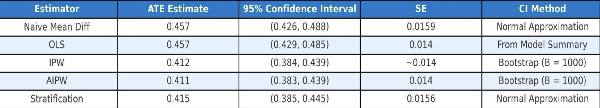

# growth-mindset-causal-inference
Causal inference project analyzing growth mindset interventions using OLS, IPW, AIPW, and propensity score stratification in R.

# Unlocking Student Potential: A Causal Analysis of Growth Mindset Interventions
This repository contains the research poster and source code for my project at Rutgers University.  
The project applies **modern causal inference techniques** to evaluate the impact of growth mindset interventions on student achievement.

---

## Highlights
- Built a **synthetic observational dataset** modeled on the National Study of Learning Mindsets.
- Applied **OLS, Inverse Probability Weighting (IPW), Augmented IPW (AIPW), and Propensity Score Stratification**.
- Verified **covariate balance** using love plots and density plots.
- Estimated **Average Treatment Effect (ATE)** consistently across methods (~0.41–0.46).
- Produced an interactive HTML poster and polished academic PDF.

---

## Repository Contents
- `Final_Poster.Rmd` — R Markdown source file.  
- `Final_Poster.html` — Interactive version of the poster.  
- `Stat_Poster.pdf` — Final poster for presentation.  
- `data/` — Synthetic dataset or script to generate data.  
- `figs/` — Key plots (covariate balance, density, ATE results).

---

## Skills Demonstrated
- **Causal Inference**: IPW, AIPW, Propensity Scores, Stratification, Trimming  
- **Statistical Modeling**: Regression Adjustment, Estimator Comparison  
- **Programming in R**: tidyverse, cobalt, ggplot2  
- **Data Visualization**: Covariate balance plots, outcome distributions, ATE comparisons  
- **Reproducible Research**: RMarkdown, GitHub hosting  

---

## Preview
Example: Estimated treatment effect using multiple causal methods.  

---

## How to View 
- [Download PDF Poster](./Stat_Poster.pdf)
- You can explore the html version of this project here:
[**View html**](https://chimbililohith.github.io/growth_mindset/) 

---

*Project completed as part of my **M.S. in Data Science at Rutgers University**.*
